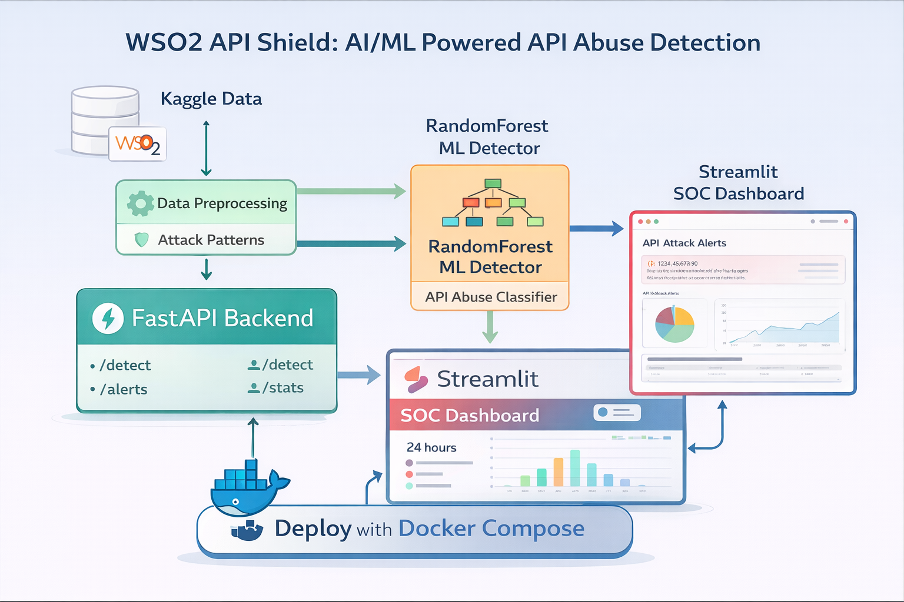

<p align="center">
  
</p>


# 🛡️ WSO2 API Shield — AI/ML Powered API Attack Detection (SOC Dashboard)

WSO2 API Shield is an end-to-end cybersecurity project that detects abnormal & malicious API traffic using **rule-based detection + Machine Learning** and provides **real-time SOC-style alerts**.


<p align="center">
  
</p>


It simulates real API gateway logs (WSO2-style), detects attack patterns such as:
- Burst traffic (DDoS-style)
- Endpoint scanning / enumeration
- Authentication abuse (401/403 spikes)

Then it trains an ML model to classify events as **Attack / Normal**, and exposes it through:
✅ FastAPI backend  
✅ Streamlit SOC Dashboard  
✅ Docker Compose deployment

---

## ⭐ Key Features
- **Attack pattern detection** (burst / scan / auth abuse)
- **ML-based attack classification** (RandomForest)
- **Real-time streaming detector** (SOC alerts)
- **FastAPI backend**
  - `/health`
  - `/detect`
  - `/alerts`
  - `/stats`
- **SOC Dashboard** (Streamlit UI)
- **Dockerized deployment** (FastAPI + Dashboard)

---

## 🧠 Why this project is unique?
Most cybersecurity ML projects focus only on phishing.  
This one focuses on **API Gateway Security**, which is a real-world WSO2 problem:

✅ API consumers can abuse endpoints  
✅ Bots can scan APIs  
✅ Credential stuffing hits login endpoints  
✅ Attackers cause downtime with high request bursts  

This project shows how AI can assist an API Gateway / SOC team.

---

## 🏗️ Architecture


        +-------------------+
        |  Kaggle Log Data   |
        +---------+---------+
                  |
                  v
        +-------------------+
        | Day 2: Build Logs |
        | + attack sessions |
        +---------+---------+
                  |
                  v
        +------------------------+
        | Day 4: Attack Patterns |
        | burst/scan/auth-abuse  |
        +-----------+------------+
                    |
                    v
        +------------------------+
        | Day 5: ML Model Train  |
        | RandomForest Classifier|
        +-----------+------------+
                    |
 +------------------+------------------+
 |                                     |
 v                                     v
+-------------------+ +-----------------------+
| Day 6 Stream | | Day 7 FastAPI Backend |
| Real-time Alerts | | /detect /alerts /stats|
+---------+----------+ +-----------+-----------+
| |
v v
+-----------------------+ +---------------------+
| live_alerts.csv report| | Day 8 SOC Dashboard |
+-----------------------+ | Streamlit UI + charts|
+---------------------+
---

## 📸 Screenshots
> Add your screenshots here:

### SOC Dashboard


### Detect API Response


---

## ⚙️ Tech Stack
- Python 3.x
- Pandas, Scikit-learn
- FastAPI + Uvicorn
- Streamlit + Plotly
- Docker + Docker Compose

---

## 🚀 Run Locally (Without Docker)

### 1) Create virtual environment
```bash
python -m venv venv
source venv/Scripts/activate
pip install -r requirements.txt
2) Run FastAPI
python -m uvicorn src.api.app:app --host 127.0.0.1 --port 8000 --reload


Open: http://127.0.0.1:8000/docs

3) Run Dashboard
streamlit run src/dashboard/app.py


Open: http://localhost:8501

🐳 Run with Docker (Recommended)
Start
docker compose up --build

Open

FastAPI Docs: http://localhost:8000/docs

SOC Dashboard: http://localhost:8501

Stop
docker compose down

🔥 Project Workflow (Day-by-Day)

Day 2: Build WSO2-style log dataset (inject attack sessions)

Day 4: Rule-based detection (burst/scan/auth abuse)

Day 5: ML model training + reporting

Day 6: Real-time stream detection + SOC alerts

Day 7: FastAPI backend

Day 8: Streamlit dashboard

Day 9: Docker compose deployment

🧩 WSO2 Integration Idea (Real)

This system can be deployed behind WSO2 API Manager:

WSO2 Gateway produces logs

API Shield consumes logs

Detects attacks (ML)

Publishes mitigation actions:

throttle policy update

block IP list

token revoke requests

SOC dashboard shows ongoing threats

👤 Author

Vinod Perera
GitHub: https://github.com/Perera1325

